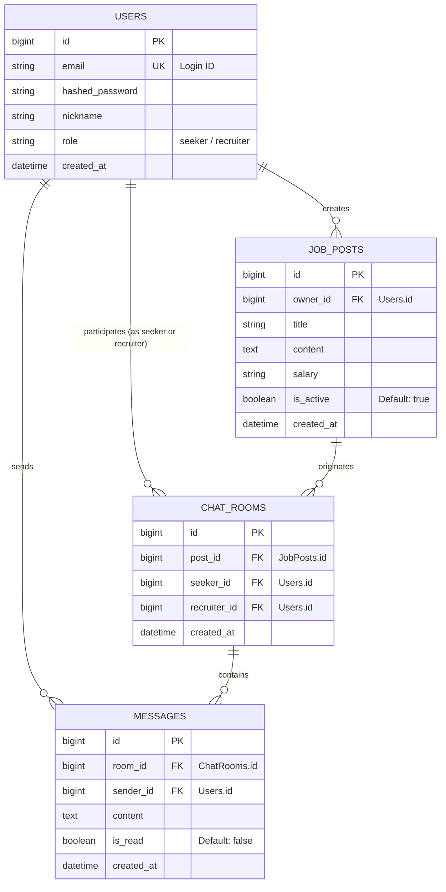

 ## [DB 설계서] (KR)

 ### 1. 개요 (Overview)

 | 항목 | 내용 | 
| :--- | :--- |
| **프로젝트명** | **Task Management App** |
| **시스템 유형** | 협업 기반 업무 티켓 관리 시스템 |
| **DB 종류** | **MySQL 8.0 이상 권장** (TypeORM 사용) |
| **버전** | **1.0.0 (초기 설계)**  |
| **설계 목적** | **사용자, 워크스페이스, 업무 티켓의 안정적인 관리 및 관계 정의** |

---
### 2. 엔티티-관계 다이어그램 (ERD)

---
### 3. 테이블 정의 상세 (Detailed Table Definition)
> 각 엔티티(테이블)에 대한 상세 정의는 다음과 같습니다.

 

**3-1. User 테이블 (사용자)**

 | 필드명(Column)| 타입(Type) | 길이(Size) | 제약 조건 | 설명 |
| :--- | :--- | :--- | :--- | :--- |
| **id** | Int |  | PK, Auto Increament | 고유 사용자 ID |
| **userAccount** | VARCHAR | 255 | NOT NULL, UNIQUE | 로그인 계정명(이메일) |
| **password** | VARCHAR | 255 | NOT NULL| 해시된 비밀번호 |
| **firstName** | VARCHAR | 100 | NULLABLE | 이름 |
| **lastName** | VARCHAR | 100 | NULLABLE | 성 |
| **createdAt** | DATETIME |  | NOT NULL, Default CURRENT_TIMESTAMP | 계정 작성 일시 |
| **updatedAt** | DATETIME |  | NOT NULL, Default CURRENT_TIMESTAMP | 최종 정보 수정 일시 |

 

**3-2. Workspace 테이블 (워크스페이스)**

 | 필드명(Column)| 타입(Type) | 길이(Size) | 제약 조건 | 설명 |
| :--- | :--- | :--- | :--- | :--- |
| **id** | Int |  | PK, Auto Increament | 고유 워크스페이스 ID |
| **name** | VARCHAR | 255 | NOT NULL | 워크스페이스 이름 |
| **description** | TEXT |  | NULABLE | 워크스페이스 설명 |
| **creatorId** | Int |  | FK(User.id), NOT NULL | 생성자의 고유 사용자 ID |
| **createdAt** | DATETIME |  | NOT NULL, Default CURRENT_TIMESTAMP | 생성 일시 |
| **updatedAt** | DATETIME |  | NOT NULL, Default CURRENT_TIMESTAMP | 수정 일시 |

 

**3-3. WorkspaceMember 테이블 (워크스페이스 멤버)**

 | 필드명(Column)| 타입(Type) | 길이(Size) | 제약 조건 | 설명 |
| :--- | :--- | :--- | :--- | :--- |
| **userId** | Int |  | PK, FK(User.id) | 고유 사용자 ID |
| **workspaceId** | Int |  | PK, FK(Workspace.id) | 고유 워크스페이스 ID |
| **role** | ENUM |  | NOT NULL | 멤버 역할 (예:'Member', 'Admin') |

 

**3-4. TicketStatus 테이블 (현재 티켓 진행 상태)**

 | 필드명(Column)| 타입(Type) | 길이(Size) | 제약 조건 | 설명 |
| :--- | :--- | :--- | :--- | :--- |
| **id** | Int |  | PK, Auto Increment | 고유 티켓 상태 ID |
| **name** | VARCHAR | 50 | NOT NULL, UNIQUE | 상태 이름 (예: To Do, Done) |
| **orderIndex** | Int |  | NOT NULL | 표시 순서 |

 

**3-5. Ticket 테이블 (업무 티켓)**

 | 필드명(Column)| 타입(Type) | 길이(Size) | 제약 조건 | 설명 |
| :--- | :--- | :--- | :--- | :--- |
| **id** | Int |  | PK, Auto Increament | 고유 티켓 ID |
| **title** | VARCHAR | 255 | NOT NULL | 티켓명 |
| **description** | TEXT |  | NULABLE | 티켓 상세 설명 |
| **workspaceId** | Int |  | FK(Workspace.id), NOT NULL | 고유 워크스페이스 ID |
| **ticketStatusId** | Int |  | FK(TicketStatus.id), NOT NULL| 고유 현재 티켓 진행 상태 ID |
| **creatorId** | Int |  | FK(User.id), NOT NULL | 작성자 고유 사용자 ID |
| **assigneeId** | Int |  | NULLABLE | 티켓 담당자 고유 사용자 ID |
| **priority** | ENUM |  | NULABLE | 우선순위 (예: high, middle...) |
| **dueDate** | DATETIME |  | NULABLE | 마감일 |
| **createdAt** | DATETIME |  | NOT NULL, Default CURRENT_TIMESTAMP | 생성 일시 |
| **updatedAt** | DATETIME |  | NOT NULL, Default CURRENT_TIMESTAMP | 수정 일시 |

